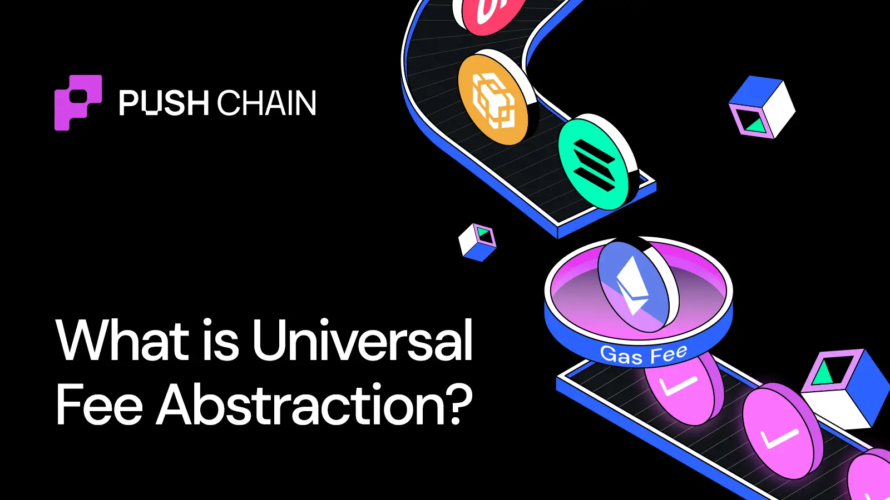
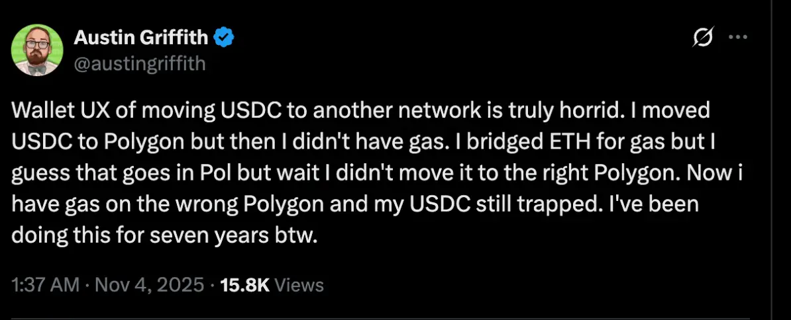

<!--truncate-->

## What is Universal Fee Abstraction?

Universal Fee Abstraction is a magical mechanism that lets users pay for network fees on any chain, in any token they already hold, while using Universal Apps on Push Chain.

One signature. One flow. Zero Friction.

Let’s break it down.

## Why Fee Abstraction Exists

For years, blockchains enforced a rigid rule:
**Pay gas in the chain’s native token.**

ETH on Ethereum
SOL on Solana
POL on Polygon
BTC on Bitcoin

This made sense when chains were isolated islands.

But as we progress towards a chain-agnostic world, following such legacy rules has proven to be one of the biggest hurdles to our mainstream adoption.

### The User Pain

#### Cold Start Problem: "I need gas to get gas"

You hold ETH and 1000 USDC on Ethereum.
A new DeFi app you want is on Arbitrum.

You connect your wallet… but can’t do anything.
Even though you have tokens, you don’t have *the right* token on the right chain.

Tokens don’t work seamlessly inter-chain. So you figure it out 🤷.

And that meant, your only option before Push Chain was:
1\. Bridge ETH
2\. Wait, do additional conversion, or wallet creation, or both
3\. Finally, use the app

Swap Arbitrum for Polygon, Solana, Base, Whatever. Same friction, new native token.

**Every new chain \= new gas token \= new friction.**

Even Industry greats like Austin Griffith call this torture out \[ LINK TWEET \- [https://x.com/austingriffith/status/1985438645130838068](https://x.com/austingriffith/status/1985438645130838068)\]



#### The Gas Portfolio Issue

Everyone in crypto is unknowingly maintaining a “gas portfolio”:

* Track native balances across chains
* Keep all of them topped up
* Constantly bridge value for fees

The overhead is ridiculous. The prep time often exceeds the actual transaction time.

Users shouldn’t be managing chain infrastructure.

They should be using apps.

### The Developers Dilemma

#### Fragmented userbases

\- Deploy on Ethereum → serve Ethereum users
\- Deploy on Solana → serve Solana users
\- Deploy on Arbitrum → serve Arbitrum users

This fragments your user base. Every chain becomes a silo, each deployment forces:

- Separate Infrastructure
- New Liquidity
- New Gas Token
- Fragmented Community

**Universal Fee Abstraction fixes this.**

**Deploy once, onboard users from everywhere.**

It’s time you focus on the product, No extra infra. No cross-chain fee logic. Just chain-native interop Magic.

## How does Universal Fee Abstraction work?

The system works in three coordinated steps:

1. Gas Estimation & Conversion (SDK handles)
2. Fee Locking on Source Chain (Universal Gateway contract handles)
3. Conversion, Credit and Attribution (Validator handles)

From a user's perspective, **all of this happens automatically when you sign a single transaction**. No bridges, no manual conversions, no multi-step flows.

### Gas estimation & Conversion

When you prepare a transaction on Push Chain (say, from your Solana wallet), the Push Chain SDK does the following:

1. **Estimates gas cost in Push Chain's native token ($PC)**

```
   Example: Transaction needs 1 PC (est. $0.3)
```

2. **Converts that cost to your origin chain's native token**

```
   SDK: "1 PC = $0.3 = 0.0003 SOL"
```

3. **Adds the gas cost to your transaction payload**

```
Your transaction now includes:

- What you want to do (e.g., swap tokens)
   - How much it costs (0.0003 SOL)
```

**The key insight:** The SDK speaks both languages, your origin chain's token (SOL, ETH,POL) and Push Chain's native token (PC). You pay in what you have; Push Chain receives what it needs.

### Fee Locking on Source Chain (Securing Your Payment)

Now that the SDK knows how much you need to pay, it locks those funds on your origin chain using a smart contract called the **Universal Gateway**.

**What is the Universal Gateway?**

The Universal Gateway is a smart contract deployed on each origin chain (Ethereum, Solana, Base, etc.) that:

* Receives and locks your native tokens (ETH, SOL, etc.)
* Receives and locks other network tokens (USDC, USDT,ARB,etc)
* Emits an event that the Push Chain’s Universal validators can verify
* Holds your tokens securely until the transaction completes

**Here's what happens:**

```
You: Sign transaction on Solana
  ↓
SDK: Deposits 0.0003 SOL into Universal Gateway on Solana
  ↓
Universal Gateway: Locks SOL, emits "FeeLocked" event
  ↓
Universal Validators: "We see 0.0003 SOL locked for transaction X"
```

**Important:** The deposit into the Universal Gateway and your intended transaction (e.g., swapping tokens on Push Chain) are **wrapped in a single universal transaction**.

You sign once. Both things happen **atomically**.

If your swap fails on Push Chain, the fee lock is never processed, and you don't lose funds.

Now it's time for the special listener entities called **Universal Validators** to verify the locked tokens and mint an equivalent amount of synthetic representations of these locked
native tokens.

Let's understand more about this process.

### C) Conversion, Credit and Attribution

Your SOL is now locked on Solana. But Push Chain's validators need $PC to execute your transaction and pay for gas. This is where the magic of automated conversion happens.

**Part A: Synthetic Token Minting**

When universal validators verify your locked SOL, they communicate with validators (that handle Push Chain’s validation) and mint a synthetic representation called **pSOL** (p \= "pegged").

```
Locked on Solana:0.0003 SOL
  ↓
Minted on Push Chain: 0.0003 pSOL
```

**Why synthetic tokens?**

Think of pSOL as a "receipt" that proves you locked real SOL on Solana. It's a 1:1 representation:

* 1 SOL locked → 1 pSOL minted
* 1 ETH locked → 1 pETH minted
* 1 POL locked → 1 pPOL minted

This works for **any token** from **any chain**.

**Part B: Swap pSOL for $PC**

Now validators swap your pSOL for Push Chain's native token ($PC) using liquidity pools (AMMs):

```
Push Chain Validators:
  ↓
Swap 0.0003 pSOL → 1 PC (via pSOL/PC AMM pool)
  ↓
Credit 1 PC to your UEA (Universal Executor Account)
```

Your Universal Executor Account (UEA) now has the $PC balance needed to execute your transaction and pay for gas.

**UEA executes your tx with the now filled Gas.**

**What are UEAs?** Universal Executor Accounts (UEAs) are magical entities that let users from any blockchain pay and transact on Universal Apps on Push Chain. Know more about them here: [What are UEAs?](https://push.org/blog/what-are-universal-executor-accounts/)

**Part C: Transaction Execution**

With $PC in your UEA, your transaction executes:

```
UEA: Execute swap on Push Chain
  ↓
Gas deducted from UEA balance
  ↓
Transaction complete ✅
```

## Gas Preloading Optimization

Without optimization, every transaction would repeat the full 5-step flow. So Push Chain preloads your gas tank on your first interaction.

If your transaction needs $0.01 or $0.10 PC, the SDK will still lock around $1 of the origin token.

→ You spend $0.10.

→ $0.90 PC remains in your UEA.

Your next transactions are instant until that balance runs low.

This is one of the biggest smoothness upgrades.

## Can I Pay Gas in Any Token, on any Chain? Yes

#### **If you pay with native tokens (ETH, SOL):**

Lock → Verify → Convert → Execute

#### **If you pay with any other token (USDC, ARB, LINK):**

Gateway auto-swaps token → native token → lock → convert → execute

You never need to open a DEX or bridge.

## Conclusion

Universal Fee Abstraction removes the single biggest blocker in multi-chain UX.

**For users:**
Pay gas in any token from any chain with one signature. No gas hunting. No bridges.

**For developers:**
Deploy once. Reach everyone. No cross-chain fee infra. No fragmentation.

This is what makes Universal Apps possible.

Explore them here: [https://push.org/ecosystem](https://push.org/ecosystem)
