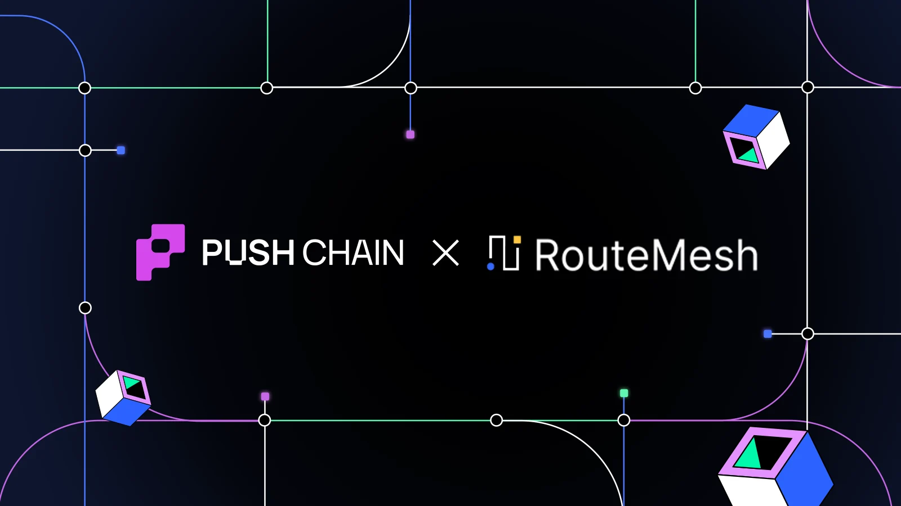
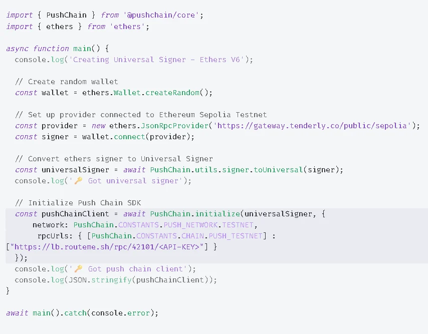

<!--truncate-->

RouteMesh now supports [Push Chain’s Donut Testnet](https://donut.push.network) through an intelligent, multi-provider RPC mesh. Developers can access the testnet through one high-uptime endpoint powered by real-time routing, automatic failover, health scoring, and support for 55+ EVM methods.

This integration strengthens a shared goal: making Push Chain easier to build on, more accessible across environments, and stable for every onchain workflow.

## **What is RouteMesh?**

[RouteMesh](https://routeme.sh/) is an RPC routing aggregator that replaces reliance on a single node provider with a mesh of globally distributed nodes.

Instead of pointing your app to one RPC source, you connect to a mesh that balances traffic automatically, evaluates node health in real time, and reroutes around failing or slow providers

With Donut Testnet added to the mesh, builders get consistent access without managing RPC infrastructure, keys, or fallbacks.

## **What is Push Chain?**

Push Chain is the first true universal L1 built to unify users, liquidity, and applications across all major blockchains (EVM and non-EVM) by introducing interop as a chain-native primitive.

Donut Testnet is the developer environment for this universal layer.

## **👷‍♂️ What this means for builders?**

* A single, stable RPC endpoint for Donut Testnet reads and writes, no more switching or juggling providers.
* Consistent environments across local, CI, and staging because all point to the same unified RouteMesh-backed RPC.
* Works with your existing stack, Hardhat, Foundry, Viem, ethers.js, and wallets. Everything works out of the box on Push Chain.
* No monitoring of node health or juggling multiple RPC URLs.

## **Here’s how to build on Push Chain with RouteMesh:**

1. Initialize the [Push Chain Client](https://push.org/docs/chain/build/initialize-push-chain-client/#initialize-push-chain-client) in your project.
2. Add the Donut Testnet RPC endpoint from RouteMesh and include your API key in the config.

3. Start making standard EVM JSON-RPC calls through the client deploy, read, write, or test contracts normally.

## **Start Building**

Push Chain Docs: [push.org/docs](http://push.org/docs)  
Access Push Chain Donut Testnet through RouteMesh:   [https://routeme.sh/chains/evm/42101-push-chain-donut-testnet](https://routeme.sh/chains/evm/42101-push-chain-donut-testnet)

You can plug this endpoint directly into your existing dev stack and start building universal, Donut-powered Universal Apps today.
